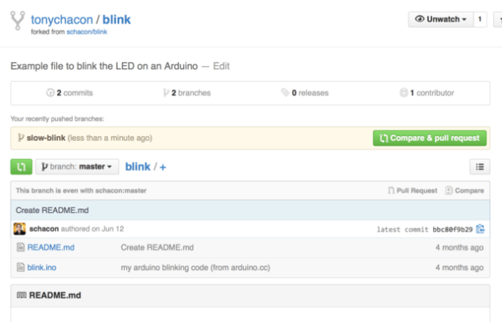

# Authentication

## 4.3 Git on the Server - Generating Your SSH Public Key

### SSH
Definition
* protocol you can  connect  and authenticate to remote servers and services


### [Generating Your SSH Public Key](https://git-scm.com/book/en/v2/Git-on-the-Server-Generating-Your-SSH-Public-Key)

[Why you need to generaate a public key](https://docs.github.com/en/authentication/connecting-to-github-with-ssh/about-ssh)
* Git doesn't allow you to connect to remote servers with just your username and password. 
* For the password you need to remote in via SSH.
* For This you will need an SSH key


``` bash
{
    # How to find your SSH Public Folder
    cd ~/.ssh
    ls
}
```

``` bash
{
  # How to generate keys
    ssh-keygen -o
}
```
#### When generating the public key 
1. Add a passphrase
    * So if someone gets access to yoru computer they don't get accces to what you use for your ssh key
1. Open up the .pub file in the public key folder
    * Use command `xdg-open id_rsa.pub`
    * This will open in GUI default for .pub files because nano cuts the full key off and it will not work
1. Copy the text in the .pub file
1. Paste the text in the Add new SSH Key file in git

## [Generate Authenticaton Token](https://www.youtube.com/watch?v=ePCBuIQJAUc&list=PLzN5nbXFIN-tt8CKVL2-wSAKnWN6Ww1G8&index=3)

1:00 Settings to find where to get your token

2:00 Settings for token

2:55 getting your key

3:20 Adding your key to your remote
* `git remote set-url origin https://<token>@github.com/<username>/<repo>`


# Contributing

## [6.2 GitHub - Contributing to a Project](https://git-scm.com/book/en/v2/GitHub-Contributing-to-a-Project)
### Github Defined
The single largest host for Git repositories, and is the central point of collaboration for millions of developers and projects. 


### Forking Projects

Defined
* When want to contribute to an existing project to which you don’t have push access, you can “fork” the project. 


### The GitHub Flow

1. Fork the project.

1. Create a topic branch from master.

1. Make some commits to improve the project.

1. Push this branch to your GitHub project.

1. Open a Pull Request on GitHub.

1. Discuss, and optionally continue committing.

1. The project owner merges or closes the Pull Request.

1. Sync the updated master back to your fork.


#### When to you clone vs fork 
https://www.theserverside.com/answer/Git-fork-vs-clone-Whats-the-difference

Clone 
* you are contributing directly to the the project and you are on the team\

Fork
* you are not apart of the team and want to work on the project


### Creating a Pull request
1. Clone our fork of the project locally. 
    * `git clone <forked-repository>`
1. Create a descriptive topic branch.
    * `git branch <branch>`
1. Make our change to the code.
1. Check that the change is good.
1. Commit our change to the topic branch.
    * `git commit -m 'message'`

1. Push our new topic branch back up to our GitHub fork.
    * `git push <remote> <new-branch>`

1. Navigate back to the Github.com > your forked repository you cloned from 
1. You should have an option for button that says "Compare & pull request" in green 
1. Press butteon to take you to the commit box on why you should merge your pull request
1. Have the owner of repository review your pull request and make a decesion to merge or not


# Your Project

## [6.3 GitHub - Maintaining a Project](https://git-scm.com/book/en/v2/GitHub-Maintaining-a-Project)


### Creating a New Repository

1. Create a New Repository
    * [If you already started the repo locally](https://docs.github.com/en/migrations/importing-source-code/using-the-command-line-to-import-source-code/adding-locally-hosted-code-to-github#adding-a-local-repository-to-github-using-git)
        1. Create a repo on Github.com repo  exactly the same name
        1. Take the url from the github repo and create a remote out of it (add your token to the address)
        1. push the branch to the repo
2. Add Collaborators(if any)
    * This gives them push access
3. Add code to repository
4. Manage Pull Requests
    * You will get an email notification
5. To be continued...